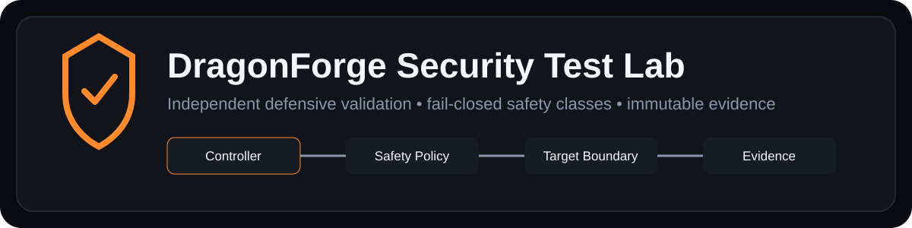
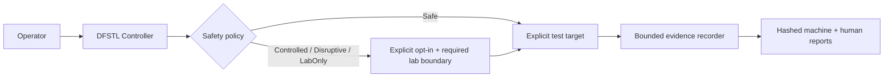

# DragonForge Security Test Lab

<p align="center">
  
</p>

DragonForge Security Test Lab (DFSTL) is an independent security-validation framework for DragonForge Security Suite. It is intentionally maintained outside the product it tests so validation can challenge product assumptions instead of trusting the same runtime, libraries, or implementation paths by default.

> **Status:** Phase 11 — Windows Multi-User & ACL Security Testing is implementation complete with verification pending. Phases 0–10 are recorded as verified complete in the project roadmap.

## What DFSTL is for

DFSTL provides repeatable white-box and black-box security tests with explicit safety classifications, synthetic secrets, immutable evidence, and clear separation between a product failure and a lab/infrastructure failure.

The framework currently covers areas such as:

- target discovery and build identification without executing the target;
- source, dependency, workflow, SBOM, and secret-oriented static analysis;
- bounded encrypted-format mutation testing;
- authenticated Agent/runtime boundary testing;
- filesystem, path, reparse-point, hard-link, and TOCTOU laboratory scenarios;
- loopback-only Password Manager sync/API probing and offline mutation corpora;
- fuzz/regression corpus generation and promotion;
- synthetic secret-leak and offline dump scanning;
- bounded failure injection and resource-stress scenarios;
- disposable Windows multi-user and ACL validation;
- finalized evidence bundles with hashes and machine-readable reports.

The repository also retains security regressions as permanent fixtures so previously discovered classes of failure can remain covered.

## Trust separation

A security test framework is most useful when the tester and target do not share implicit trust. DFSTL therefore keeps its runner, evidence model, synthetic fixtures, and safety policy in its own repository.

Tests are divided into four execution classes:

| Class | Intended boundary |
| --- | --- |
| **Safe** | Read-only or isolated operations suitable for an ordinary development workstation |
| **Controlled** | Temporary adversarial inputs or bounded local test resources with explicit opt-in |
| **Disruptive** | Operations that may terminate test processes, consume meaningful resources, or alter temporary test state |
| **LabOnly** | Operations restricted to disposable/dedicated lab environments or accounts |

Higher-risk classes are never meant to be silently treated as default tests. See [SAFETY.md](SAFETY.md) and [Test Taxonomy](docs/TEST_TAXONOMY.md).

### Safety and evidence flow



This diagram is intentionally high level: it explains trust separation and gating without exposing offensive operational instructions.

## Architecture

```text
apps/dfstl-cli/      test-controller CLI
crates/dfstl-core/   runner, policy, evidence, hashing, and reports
config/              example lab configuration
corpus/              intentional synthetic/regression security fixtures
docs/                architecture, schemas, threat model, roadmap, phase records
scripts/             Windows validation harnesses
```

The current Cargo workspace is intentionally small. At the last dependency audit, the CLI depended only on the first-party core crate; future third-party dependencies must be reviewed rather than assumed compatible.

See [Architecture](docs/ARCHITECTURE.md) and [Threat Model](docs/THREAT_MODEL.md).

### Public visual captures

DFSTL is primarily a CLI/evidence framework, so Phase 5 does not invent a graphical dashboard or publish sensitive lab output. A safe screenshot/report set using real executions and synthetic fixtures is defined in [Public Visual Capture](docs/PUBLIC_SCREENSHOT_CAPTURE.md).

## Safe evaluation

Start with the framework's read-only/safe surfaces rather than higher-risk lab operations:

```powershell
cargo run -p dfstl-cli -- list
cargo run -p dfstl-cli -- target inspect --target C:\DragonForge-Test-Build
```

A completed runner execution produces a finalized evidence directory containing machine-readable and human-readable reports plus SHA-256 evidence manifests.

Repository validation can be run with the phase-specific PowerShell harnesses documented under [`docs/`](docs/). LabOnly and disruptive scenarios should only be run in the environment required by their documentation and with the explicit acknowledgement flags described there.

## Safety and security boundaries

DFSTL is a defensive validation project, not an attack cookbook.

- Test credentials and secrets must be synthetic.
- Generated evidence must not serialize real protected data.
- Live network probing is intentionally narrow; the Password Manager sync harness is restricted to explicit IPv4 loopback targets.
- Mutation tooling works from copied/synthetic inputs and does not overwrite live product state by default.
- Resource-stress paths are bounded and isolated to lab-owned processes/resources.
- Process-termination testing targets DFSTL-owned child processes rather than arbitrary system processes.
- Windows multi-user/ACL scenarios use temporary accounts and disposable test roots and require an elevated lab context.
- Failure of an external tool or lab prerequisite is not automatically interpreted as a clean security result.

The checked-in `corpus/` contains intentional synthetic/regression material that may resemble secrets. It is test data and should not be removed merely because secret scanners recognize its patterns.

For vulnerability-reporting guidance, see [SECURITY.md](SECURITY.md). Its current-status section is aligned with the Phase 11 implementation/verification state and should be read alongside the live roadmap for future phase changes.

## Documentation

- [Safety Policy](SAFETY.md) — execution classes and operator rules
- [Security Policy](SECURITY.md) — security reporting and project boundaries
- [Architecture](docs/ARCHITECTURE.md) — runner and evidence design
- [Threat Model](docs/THREAT_MODEL.md) — adversaries and trust assumptions
- [Test Taxonomy](docs/TEST_TAXONOMY.md) — classification of validation work
- [Roadmap](docs/ROADMAP.md) — full implementation history and planned phases
- [Report Schema](docs/REPORT_SCHEMA.md) — finalized evidence/report contract
- [Public Visual Capture](docs/PUBLIC_SCREENSHOT_CAPTURE.md) — synthetic evidence/screenshot capture rules
- [Third-party notices](THIRD_PARTY_NOTICES.md) — current dependency/material status
- [`docs/`](docs/) — phase records and specialized evidence/mutation schemas

Detailed operational procedures remain in the phase-specific documents so the root landing page can stay focused on purpose, safety, and evaluation.

## Limitations

Phase 11 verification is still pending, so its implementation should not be described as fully qualified yet. Future phases also remain planned for broader VM/multi-machine orchestration and CI/release security gates.

DFSTL itself is not a substitute for an independent external security audit, professional penetration test, or formal assurance process. Its evidence shows what its defined tests observed under their stated assumptions and environments.

## Personal / Portfolio Use Disclaimer

This repository is maintained for my personal projects, learning, evaluation, authorized security research, and portfolio demonstration. It is not intended or offered as a commercial product, managed service, professional consulting service, certification, warranty, or guarantee of fitness for any particular purpose.

Any third party who chooses to compile, run, adapt, evaluate, or otherwise use material from this repository does so entirely at their own risk and is responsible for ensuring that their use is lawful, authorized, appropriate for their environment, and compliant with applicable licenses and third-party terms.

To the maximum extent permitted by applicable law, I assume no responsibility or liability for loss, damage, data loss, service interruption, security incidents, system changes, misuse, legal or regulatory consequences, or any other outcome arising from another person's use of or reliance on this repository or its materials.

This disclaimer does not expand the permissions granted by the repository's license. The licensing terms below continue to control whether and how the material may be used.

## Licensing

Copyright © 2026 David James. All rights reserved.

Original DragonForge material in this repository is **source-visible, not open source**. Except for rights expressly required by GitHub's Terms of Service for public repositories, no general permission is granted to use, copy, modify, redistribute, sublicense, sell, commercially exploit, or incorporate original DragonForge material into another work.

See [LICENSE](LICENSE) for the full DragonForge Proprietary Source Notice. Third-party material retains its independent rights; see [THIRD_PARTY_NOTICES.md](THIRD_PARTY_NOTICES.md).